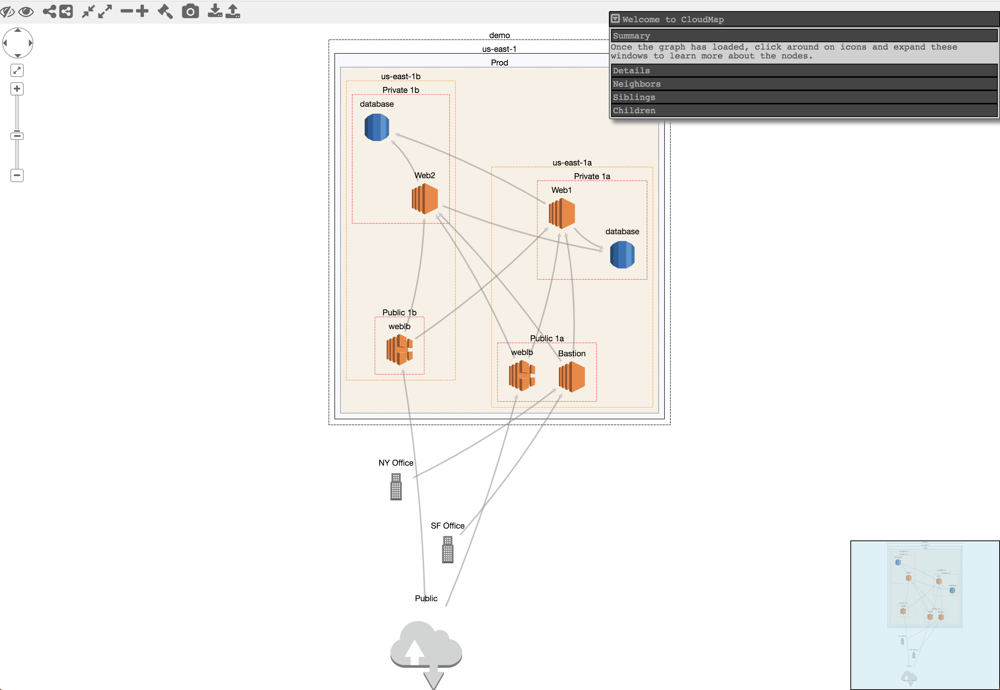

CloudMapper
========
CloudMapper generates network diagrams of Amazon Web Services (AWS) environments and displays them via your browser. It helps you understand visually what exists in your accounts and identify possible network misconfigurations.

*Demo: https://duo-labs.github.io/cloudmapper/*

*Intro post: https://duo.com/blog/introducing-cloudmapper-an-aws-visualization-tool*

*Post to show usage in spotting misconfigurations: https://duo.com/blog/spotting-misconfigurations-with-cloudmapper*


There are four stages to using CloudMapper:
1. Configure information about your account.
2. Collect information about an AWS account via a shell script that uses the AWS CLI.
3. Convert that data into a format usable by the web browser.
4. Run a simple web server to view the collected data in your browser.


## Installation

Requirements:
- `pip` and `virtualenv`
- You will also need `jq` (https://stedolan.github.io/jq/) and the library `pyjq` (https://github.com/doloopwhile/pyjq), which require some additional tools installed that will be shown.

On macOS:

```
# clone the repo
git clone git@github.com:duo-labs/cloudmapper.git
# Install pre-reqs for pyjq
brew install autoconf automake libtool jq
cd cloudmapper/
virtualenv venv
source venv/bin/activate
pip install -r requirements.txt
```

On Linux:
```
# clone the repo
git clone git@github.com:duo-labs/cloudmapper.git
# (Centos, Fedora, RedHat etc.):
# sudo yum install autoconf automake libtool python-devel jq
# (Debian, Ubuntu etc.):
# You may additionally need "build-essential"
sudo apt-get install autoconf automake libtool python-dev jq
cd cloudmapper/
virtualenv venv
source venv/bin/activate
pip install -r requirements.txt
```

With Docker:
```
# Clone the repo
git clone git@github.com:duo-labs/cloudmapper.git
# Edit config.json
vi config.json
# Build the docker container
docker-compose build
# Set the accountname and run the container (assuming aws_* variables are set)
accountname="testaccount"  docker-compose up
```

## Run with demo data

A small set of demo data is provided.  This will display the same environment as the demo site https://duo-labs.github.io/cloudmapper/ 

```
python cloudmapper.py prepare --config config.json.demo --account demo
python cloudmapper.py serve
```

This will run a local webserver at http://127.0.0.1:8000/

Alternatively using docker:
```
docker-compose build && accountname="demo" docker-compose up
```

# Running with your own data

## 1. Configure your account

### Option 1: Edit config file manually
Copy the `config.json.demo` to `config.json` and edit it to include your account ID and name (ex. "prod"), along with any external CIDR names. A CIDR is an IP range such as `1.2.3.4/32` which means only the IP `1.2.3.4`.

### Option 2: Generate config file
CloudMapper has commands to configure your account:

```
python cloudmapper.py {add-account|remove-account} --config-file CONFIG_FILE --name NAME --id ID [--default DEFAULT]
python cloudmapper.py {add-cidr|remove-cidr} --config-file CONFIG_FILE --cidr CIDR --name NAME
```

This will allow you to define the different AWS accounts you use in your environment and the known CIDR IPs.


## 2. Gather data about the account

This step uses the CLI to make `describe` calls and records the json in the folder you specify (in this case, named `my_account`). You must have AWS credentials configured that can be used by the CLI.  You must have read-only permissions on the account.  This can be granted via the `SecurityAudit` policy, or can be reduced to an even more minimal set of permissions if desired.  The minimal policy needed is:

```
{
  "Version": "2012-10-17",
  "Statement": [
    {
      "Effect": "Allow",
      "Resource": "*",
      "Action": [
        "ec2:DescribeRegions",
        "ec2:DescribeAvailabilityZones",
        "ec2:DescribeVpcs",
        "ec2:DescribeSubnets",
        "ec2:DescribeSecurityGroups",
        "ec2:DescribeVpcPeeringConnections",
        "ec2:DescribeInstances",
        "ec2:DescribeNetworkInterfaces",
        "rds:DescribeDBInstances",
        "elasticloadbalancing:DescribeLoadBalancers"
      ]
    }
  ]
}
```

Collecting the data can be performed with a bash script or via the python code base.  Both options support a `--profile-name` to specify the AWS account profile to use.

### Option 1: Bash script
Using the script is helpful if you need someone else to get this data for you without fiddling with setting up the python environment.

```
./collect_data.sh --account my_account
```

`my_account` is just a name for your account (ex. "prod").  You can also pass a `--profile` option if you have multiple AWS profiles configured.  You should now have a directory with .json files describing your account in a directory named after account name.

### Option 2: Python code

```
python cloudmapper.py gather --account-name my_account
```


## 3. Prepare the data

This step converts the collected AWS data into a format that can be displayed in the browser by generating a `web/data.json` file.
```
python cloudmapper.py prepare --account-name my_account
```

There are a number of filtering options that can be applied here to reduce the number of nodes and edges.  This will help the diagram look better, by removing some of its complexity, and is also needed for large environments that will not render.

The most useful filtering options:
* `--regions`: Restrict the diagram to a set regions, ex. `us-east-1,us-east-2`
* `--vpc-ids` and `--vpc-names`: Restrict the diagram to a set of VPCs.
* `--collapse-by-tag`: This is very useful to provide a tag name, and all nodes with that tag will be reduced to a single displayed node.

The other filtering options are:
* `--internal-edges` (default) and `--no-internal-edges`: When you only care about showing what is publicly accessible, use `--no-internal-edges`.
* `--inter-rds-edges` and `--no-inter-rds-edges` (default): By default, any communication paths between RDS nodes are not shown, as this is unlikely to be of interest. To display them, use `--inter-rds-edges`.
* `--read-replicas` (default) and `--no-read-replicas`: By default, RDS read replica nodes are shown. You can ignore them by using `--no-read-replicas`.
* `--azs` (default) and `--no-azs`: Availability zones are shown by default.  To ignore them, use `--no-azs`.


## 4. Run a webserver

You can host the `web` directory with your webserver of choice, or just run:

```
python cloudmapper.py serve
```


Using the UI
============

Mouse actions
-------------
- Pan and zoom can be done with the UI controls, or arrow keys and -/+ keys.
- Clicking on a node selects it (background turns yellow).  Double-clicking a node makes its deleted neighbors visible again.
- Unselect a node by clicking on a new one, or holding shift and clicking on the selected node again.
- Holding down shift can be used to select multiple nodes. Holding shift, clicking, and dragging over an area, selects all nodes that overlap that area.
- Click on a node and drag it to move it around.


Commands
--------
- Delete (d): Select a node and click the eye with a slash through it to delete (ie. hide) it. Click the eye to undelete (unhide) all deleted nodes.   All nodes connected to a deleted node will get a black border. If you double-click on a node with a black border, its deleted neighbors will be undeleted.


- Highlight (h): Select a node and click the symbol of the connected nodes to highlight the neighbors of a node. Click the inverse symbol to unhighlight the neighbors.  Highlight neighbors makes it easier to see which nodes are connected.


- Collapse all: Click the icon of the arrows pointed toward each other to collapse all nodes.  Click the symbol of the arrows pointed away to uncollapse all collapsed node.


- Collapse (c/e): The "minus" symbol will collapse a node, and the "plus" symbol will expand it.
- Randomize layout (r): The hammer symbol will randomly layout the diagram in a new way.
- Save image: The camera symbol will save a high resolution image of the diagram. This is helpful when your diagram has many nodes such that you must be zoomed out, so a screenshot would not get the same level of detail.
- Import/Export: This will save the layout as a json file that you can then upload. This is helpful if you've moved nodes or made other changes and wish to "save" your work. Re-opening saved files does have some bugs.


When you first start, the initial layout is never ideal.  We use what is believed to be the best layout algorithm for compound node diagrams, [CoSE](https://github.com/cytoscape/cytoscape.js-cose-bilkent), but this will still require manual editing by moving nodes around.

Here is the layout you'll likely see initially when you view the demo:



Licenses
--------
- cytoscape.js: MIT
  https://github.com/cytoscape/cytoscape.js/blob/master/LICENSE
- cytoscape.js-qtip: MIT
  https://github.com/cytoscape/cytoscape.js-qtip/blob/master/LICENSE
- cytoscape.js-grid-guide: MIT
  https://github.com/iVis-at-Bilkent/cytoscape.js-grid-guide
- cytoscape.js-panzoom: MIT
  https://github.com/cytoscape/cytoscape.js-panzoom/blob/master/LICENSE
- jquery: JS Foundation
  https://github.com/jquery/jquery/blob/master/LICENSE.txt
- jquery.qtip: MIT
  https://github.com/qTip2/qTip2/blob/master/LICENSE
- cytoscape-navigator: MIT
  https://github.com/cytoscape/cytoscape.js-navigator/blob/c249bd1551c8948613573b470b30a471def401c5/bower.json#L24
- cytoscape.js-autopan-on-drag: MIT
  https://github.com/iVis-at-Bilkent/cytoscape.js-autopan-on-drag
- font-awesome: MIT
  http://fontawesome.io/
- FileSave.js: MIT
  https://github.com/eligrey/FileSaver.js/blob/master/LICENSE.md
- circular-json: MIT
  https://github.com/WebReflection/circular-json/blob/master/LICENSE.txt
- rstacruz/nprogress: MIT
  https://github.com/rstacruz/nprogress/blob/master/License.md
- mousetrap: Apache
  https://github.com/ccampbell/mousetrap/blob/master/LICENSE
- akkordion MIT
  https://github.com/TrySound/akkordion/blob/master/LICENSE
