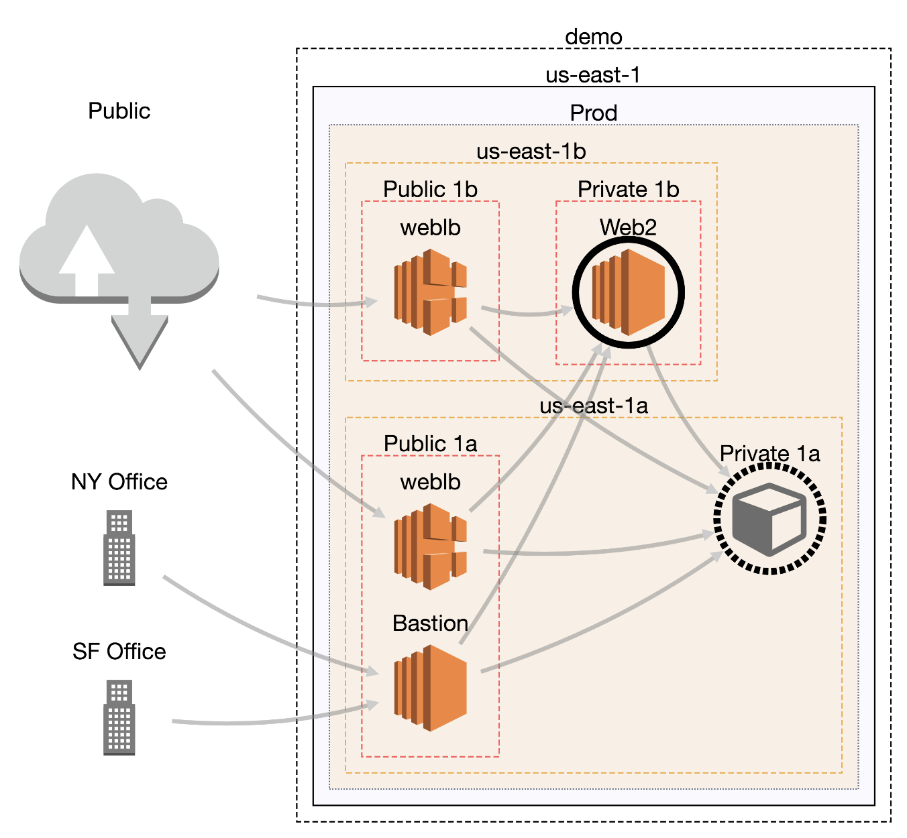
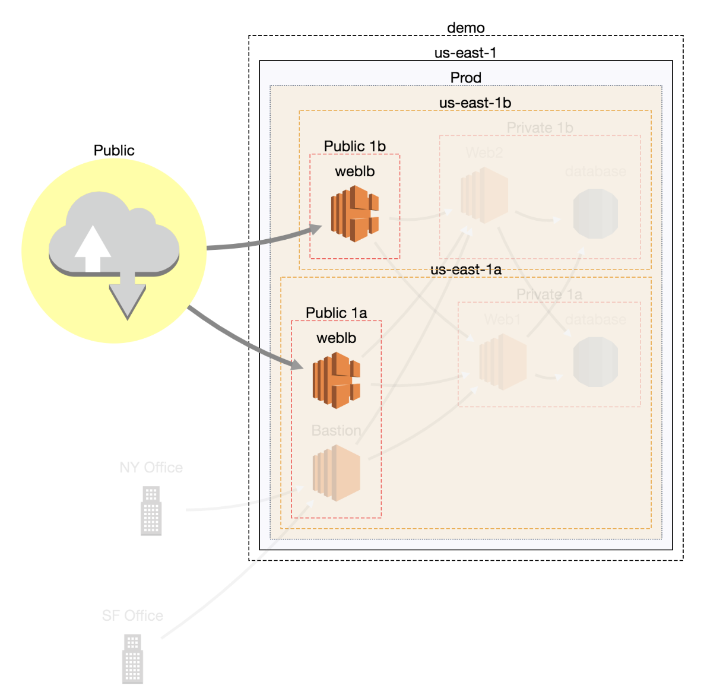

CloudMapper
========
CloudMapper generates network diagrams of Amazon Web Services (AWS) environments and display them via your browser. It helps you understand visually what exists in your accounts and identify possible network misconfigurations.

*See demo https://duo-labs.github.io/cloudmapper/*


There are three stages to using CloudMapper:
1. Collect information about an AWS account via a shell script that uses the AWS CLI.
2. Convert that data into a format usable by the web browser.
3. Run a simple web server to view the collected data in your browser.


## Installation

On macOS:

```
# Install pre-reqs for pyjq
brew install autoconf automake libtool
virtualenv venv
source venv/bin/activate
pip install -r requirements.txt
```

On Linux:
```
sudo yum install autoconf automake libtool python-dev
virtualenv venv
source venv/bin/activate
pip install -r requirements.txt
```

## Run with demo data

A small set of demo data is provided.  This will display the same environment as the demo site https://duo-labs.github.io/cloudmapper/ 

```
python cloudmapper.py prepare --config config.json.demo --account demo
python cloudmapper.py serve
```

This will run a local webserver at http://127.0.0.1:8000/

# Running with your own data

## 1. Collect data about the account

This step uses the CLI to make `describe` calls and records the json in the folder you specify (in this case, named `my_account`). You must have AWS credentials configured that can be used by the CLI.  You must have read-only permissions on the account.  This can be granted via the `SecurityAuditor` policy, or can be reduced to an even more minimal set of permissions if desired.

```
./collect_data.sh --account my_account
```

`my_account` is just a name for your account (ex. "prod").  You should now have a directory with .json files describing your account.

Copy the `config.json.demo` to `config.json` and edit it to include your account ID and name (ex. "prod"), along with any external CIDR names.

## 2. Prepare the data

This step converts the collected AWS data into a format that can be displayed in the browser by generating a `web/data.json` file.
```
python cloudmapper.py prepare --account my_account
```

## 3. Run a webserver

You can host the `web` directory with your webserver of choice, or just run:

```
python cloudmapper.py serve
```


Using the UI
============

Mouse actions
-------------
- Pan and zoom can be done with the UI controls, or arrow keys and -/+ keys.
- Clicking on a node selects it (background turns yellow).  Double-clicking a node makes it's deleted neighbors visible again.
- Unselect a node by clicking on a new one, or holding shift and clicking on the selected node again.
- Holding down shift can be used to select multiple nodes. Holding shift, clicking, and dragging over an area, selects all nodes that overlap that area.
- Click on a node and drag it to move it around.


Commands
--------
- Delete (d): Select a node and click the eye with a slash through it to delete (ie. hide) it. Click the eye to undelete (unhide) all deleted nodes.   All nodes connected to a deleted node will get a black border. If you double-click on a node with a black border, it's deleted neighbors will be undeleted.


- Highlight (h): Select a node and click the symbol of the connected nodes to highlight the neighbors of a node. Click the inverse symbol to unhighlight the neighbors.  Highlight neighbors makes it easier to see which nodes are connected.


- Collapse all: Click the icon of the arrows pointed toward each other to collapse all nodes.  Click the symbol of the arrows pointed away to uncollapse all collapsed node.


- Collapse (c/e): The "minus" symbol will collapse a node, and the "plus" symbol will expand it.
- Randomize layout (r): The hammer symbol will randomly layout the diagram in a new way.
- Save image: The camera symbol will save a high resolution image of the diagram. This is helpful when your diagram has many nodes such that you must be zoomed out, so a screenshot would not get the same level of detail.
- Import/Export: This will save the layout as a json file that you can then upload. This is helpful if you've moved nodes or made other changes and wish to "save" your work. Re-opening saved files does have some bugs.


When you first start, the initial layout is never ideal.  We use what is believed to be the best layout algorithm for compound node diagrams, [CoSE](https://github.com/cytoscape/cytoscape.js-cose-bilkent), but this will still require manual editing by moving nodes around.

Here is the layout you'll likely see initially when you view the demo:


Licenses
--------
- cytoscape.js: MIT
  https://github.com/cytoscape/cytoscape.js/blob/master/LICENSE
- cytoscape.js-qtip: MIT
  https://github.com/cytoscape/cytoscape.js-qtip/blob/master/LICENSE
- cytoscape.js-grid-guide: MIT
  https://github.com/iVis-at-Bilkent/cytoscape.js-grid-guide
- cytoscape.js-panzoom: MIT
  https://github.com/cytoscape/cytoscape.js-panzoom/blob/master/LICENSE
- jquery: JS Foundation
  https://github.com/jquery/jquery/blob/master/LICENSE.txt
- jquery.qtip: MIT
  https://github.com/qTip2/qTip2/blob/master/LICENSE
- cytoscape-navigator: MIT
  https://github.com/cytoscape/cytoscape.js-navigator/blob/c249bd1551c8948613573b470b30a471def401c5/bower.json#L24
- cytoscape.js-autopan-on-drag: MIT
  https://github.com/iVis-at-Bilkent/cytoscape.js-autopan-on-drag
- font-awesome: MIT
  http://fontawesome.io/
- FileSave.js: MIT
  https://github.com/eligrey/FileSaver.js/blob/master/LICENSE.md
- circular-json: MIT
  https://github.com/WebReflection/circular-json/blob/master/LICENSE.txt
- rstacruz/nprogress: MIT
  https://github.com/rstacruz/nprogress/blob/master/License.md
- mousetrap: Apache
  https://github.com/ccampbell/mousetrap/blob/master/LICENSE
- akkordion MIT
  https://github.com/TrySound/akkordion/blob/master/LICENSE
