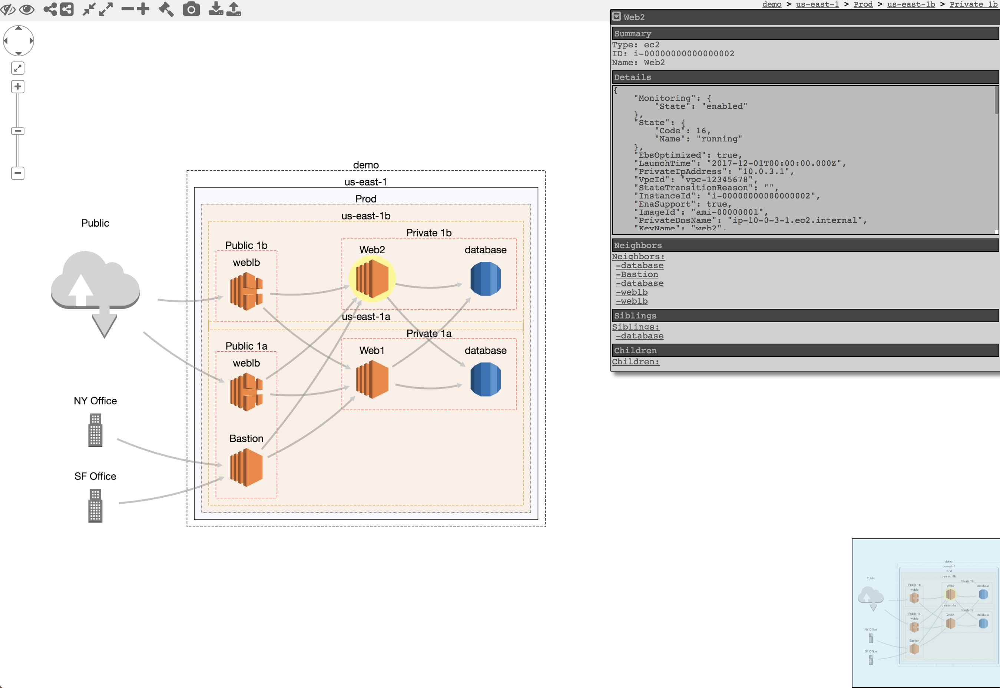

CloudMapper
========
[](https://travis-ci.org/duo-labs/cloudmapper)

CloudMapper helps you analyze your Amazon Web Services (AWS) environments.  The original purpose was to generate network diagrams and display them in your browser.  It now contains much more functionality.

*Demo: https://duo-labs.github.io/cloudmapper/*

*Intro post: https://duo.com/blog/introducing-cloudmapper-an-aws-visualization-tool*

*Post to show usage in spotting misconfigurations: https://duo.com/blog/spotting-misconfigurations-with-cloudmapper*



## Installation

Requirements:
- python 3 (3.7.0rc1 is known to work), `pip`, and `virtualenv`
- You will also need `jq` (https://stedolan.github.io/jq/) and the library `pyjq` (https://github.com/doloopwhile/pyjq), which require some additional tools installed that will be shown.

On macOS:

```
# clone the repo
git clone git@github.com:duo-labs/cloudmapper.git
# Install pre-reqs for pyjq
brew install autoconf automake libtool jq awscli python3
cd cloudmapper/
pipenv install --skip-lock
pipenv shell
```

On Linux:
```
# clone the repo
git clone git@github.com:duo-labs/cloudmapper.git
# (AWS Linux, Centos, Fedora, RedHat etc.):
# sudo yum install autoconf automake libtool python3-devel.x86_64 python3-tkinter jq awscli
# (Debian, Ubuntu etc.):
# You may additionally need "build-essential"
sudo apt-get install autoconf automake libtool python3.7-dev python3-tk jq awscli
cd cloudmapper/
pipenv install --skip-lock
pipenv shell
```


## Run with demo data

A small set of demo data is provided.  This will display the same environment as the demo site https://duo-labs.github.io/cloudmapper/ 

```
python cloudmapper.py prepare --config config.json.demo --account demo
python cloudmapper.py webserver
```

This will run a local webserver at http://127.0.0.1:8000/


# Setup

1. Configure information about your account.
2. Collect information about an AWS account.

## 1. Configure your account

### Option 1: Edit config file manually
Copy the `config.json.demo` to `config.json` and edit it to include your account ID and name (ex. "prod"), along with any external CIDR names. A CIDR is an IP range such as `1.2.3.4/32` which means only the IP `1.2.3.4`.

### Option 2: Generate config file
CloudMapper has commands to configure your account:

```
python cloudmapper.py configure {add-account|remove-account} --config-file CONFIG_FILE --name NAME --id ID [--default DEFAULT]
python cloudmapper.py configure {add-cidr|remove-cidr} --config-file CONFIG_FILE --cidr CIDR --name NAME
```

This will allow you to define the different AWS accounts you use in your environment and the known CIDR IPs.


## 2. Collect data about the account

This step uses the CLI to make `describe` and `list` calls and records the json in the folder specified by the account name under `account-data`.

### AWS Privileges required
You must have AWS credentials configured that can be used by the CLI with read permissions for the different metadata to collect.  I recommend using [aws-vault](https://github.com/99designs/aws-vault).  CloudMapper will collect IAM information, which means you MUST use MFA.  Only the `collect` step requires AWS access.

You must have the following privileges (these grant various read access of metadata):

- `arn:aws:iam::aws:policy/SecurityAudit`
- `arn:aws:iam::aws:policy/job-function/ViewOnlyAccess`

And also:
```
{
    "Version": "2012-10-17",
    "Statement": [
        {
            "Action": [
                "acm:DescribeCertificate",
                "apigateway:GET",
                "ec2:DescribeLaunchTemplates",
                "eks:DescribeCluster",
                "eks:ListClusters",
                "elasticfilesystem:DescribeMountTargetSecurityGroups",
                "elasticfilesystem:DescribeMountTargets",
                "elasticmapreduce:DescribeCluster",
                "elasticmapreduce:DescribeSecurityConfiguration",
                "events:DescribeRule",
                "fms:ListComplianceStatus",
                "fms:ListPolicies",
                "guardduty:ListDetectors",
                "guardduty:ListFindings",
                "guardduty:ListIPSets",
                "guardduty:ListInvitations",
                "guardduty:ListMembers",
                "guardduty:ListThreatIntelSets",
                "iam:GetSSHPublicKey",
                "inspector:DescribeAssessmentRuns",
                "inspector:DescribeAssessmentTargets",
                "inspector:DescribeAssessmentTemplates",
                "inspector:DescribeCrossAccountAccessRole",
                "inspector:DescribeFindings",
                "inspector:DescribeResourceGroups",
                "inspector:DescribeRulesPackages",
                "iot:DescribeAuthorizer",
                "iot:DescribeCACertificate",
                "iot:DescribeCertificate",
                "iot:DescribeDefaultAuthorizer",
                "iot:GetPolicy",
                "iot:GetPolicyVersion",
                "lambda:GetFunctionConfiguration",
                "lightsail:GetInstances",
                "lightsail:GetLoadBalancers",
                "opsworks:DescribeStacks",
                "organizations:DescribeAccount",
                "organizations:DescribeCreateAccountStatus",
                "organizations:DescribeHandshake",
                "organizations:DescribeOrganization",
                "organizations:DescribeOrganizationalUnit",
                "organizations:DescribePolicy",
                "organizations:ListAWSServiceAccessForOrganization",
                "shield:DescribeAttack",
                "shield:DescribeProtection",
                "shield:DescribeSubscription",
                "sso:DescribePermissionsPolicies",
                "sso:ListApplicationInstanceCertificates",
                "sso:ListApplicationInstances",
                "sso:ListApplicationTemplates",
                "sso:ListApplications",
                "sso:ListDirectoryAssociations",
                "sso:ListPermissionSets",
                "sso:ListProfileAssociations",
                "sso:ListProfiles"
            ],
            "Resource": "*",
            "Effect": "Allow"
        }
    ]
}
```

### Collect the data

Collecting the data is done as follows:

```
python cloudmapper.py collect --account my_account
```


# Commands

- `api_endpoints`: List the URLs that can be called via API Gateway.
- `audit`: Check for potential misconfigurations.
- `collect`: Collect metadata about an account. More details [here](https://summitroute.com/blog/2018/06/05/cloudmapper_collect/).
- `find_admins`: Look at IAM policies to identify admin users and roles and spot potential IAM issues. More details [here](https://summitroute.com/blog/2018/06/12/cloudmapper_find_admins/).
- `prepare`/`webserver`: See [Network Visualizations](docs/network_visualizations.md)
- `public`: Find public hosts and port ranges. More details [here](https://summitroute.com/blog/2018/06/13/cloudmapper_public/).
- `sg_ips`: Get geoip info on CIDRs trusted in Security Groups. More details [here](https://summitroute.com/blog/2018/06/12/cloudmapper_sg_ips/).
- `stats`: Show counts of resources for accounts. More details [here](https://summitroute.com/blog/2018/06/06/cloudmapper_stats/).
- `wot`: Show Web Of Trust. More details [here](https://summitroute.com/blog/2018/06/13/cloudmapper_wot/).


Licenses
--------
- cytoscape.js: MIT
  https://github.com/cytoscape/cytoscape.js/blob/master/LICENSE
- cytoscape.js-qtip: MIT
  https://github.com/cytoscape/cytoscape.js-qtip/blob/master/LICENSE
- cytoscape.js-grid-guide: MIT
  https://github.com/iVis-at-Bilkent/cytoscape.js-grid-guide
- cytoscape.js-panzoom: MIT
  https://github.com/cytoscape/cytoscape.js-panzoom/blob/master/LICENSE
- jquery: JS Foundation
  https://github.com/jquery/jquery/blob/master/LICENSE.txt
- jquery.qtip: MIT
  https://github.com/qTip2/qTip2/blob/master/LICENSE
- cytoscape-navigator: MIT
  https://github.com/cytoscape/cytoscape.js-navigator/blob/c249bd1551c8948613573b470b30a471def401c5/bower.json#L24
- cytoscape.js-autopan-on-drag: MIT
  https://github.com/iVis-at-Bilkent/cytoscape.js-autopan-on-drag
- font-awesome: MIT
  http://fontawesome.io/
- FileSave.js: MIT
  https://github.com/eligrey/FileSaver.js/blob/master/LICENSE.md
- circular-json: MIT
  https://github.com/WebReflection/circular-json/blob/master/LICENSE.txt
- rstacruz/nprogress: MIT
  https://github.com/rstacruz/nprogress/blob/master/License.md
- mousetrap: Apache
  https://github.com/ccampbell/mousetrap/blob/master/LICENSE
- akkordion MIT
  https://github.com/TrySound/akkordion/blob/master/LICENSE
